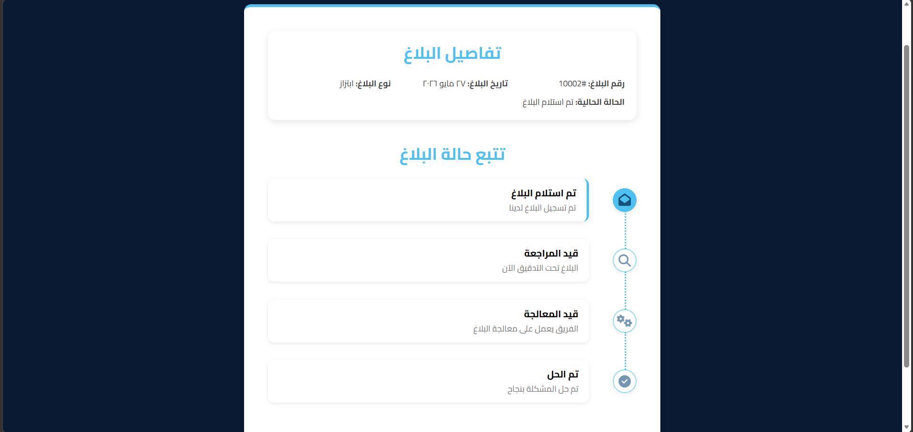
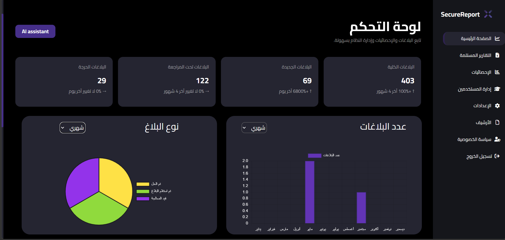
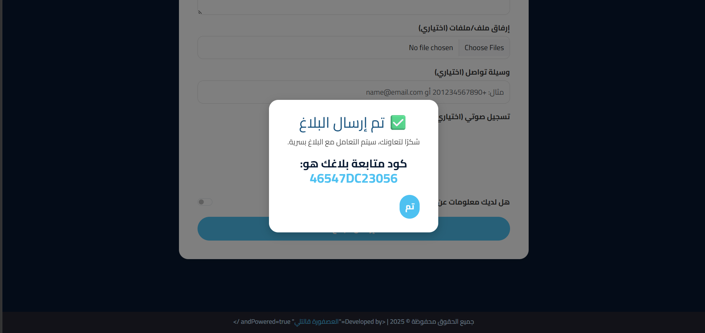
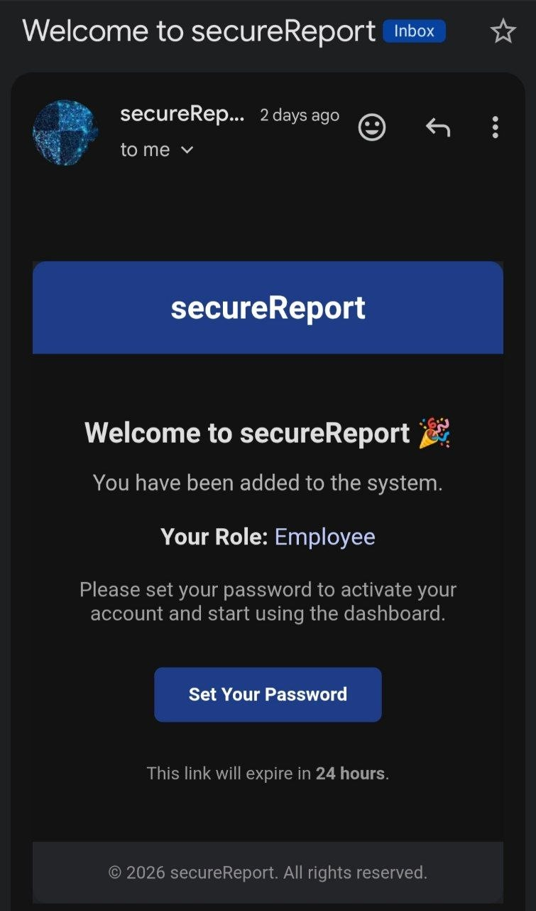

<div align="center">

# 🛡️ SecureReport


<br/>

🏆 **Digitopia 2025** — Phase 3 of 4 · Cybersecurity track  
National ICT Competition · Ministry of Communications, Egypt

>Full-stack project (Django REST API + React frontend deployed separately)

**Live Demo**
- Public Portal (Frontend): https://secure-report.netlify.app/
  Deployed by teammate

- Authority Dashboard: Not deployed yet 

- Backend API: https://salmakhalill.pythonanywhere.com

</div>

---

People don't report crimes mostly because they're afraid. Afraid of being identified. Afraid of retaliation. Afraid that no one will take it seriously.

SecureReport was built to remove that fear. — anonymous submission, no account, just a tracking code to follow your case.

> **This repo is the backend only.** Two React frontends were built by a teammate. My role was the API, database design, analytics module, deployment, and integration with the frontend.

---

## Screenshots

| Public portal — tracking timeline | Authority dashboard |
|---|---|
|  |  |

| Tracking code after submit | Welcome email — sent automatically when a new staff account is created |
|---|---|
|  |  |

> More screenshots in [`docs/screenshots/`](docs/screenshots/) — report form, tracking code on submit, status updates, email templates.

---

## How it works

**Public portal** — anyone submits a report anonymously: location, date, description, suspect info, and file attachments. On submit, a 12-character tracking code is generated. Enter it later to see the case move through a live status timeline.

**Authority dashboard** — staff log in with JWT (Admin / Employee / Viewer). KPI cards track total, new, under review, and critical cases with trend indicators. Analytics charts have daily/weekly/monthly views filterable by year. Reports move to archive automatically when closed or solved.

**AI severity classifier** *(disabled in production)* — fine-tuned Arabic BERT model predicts حرج / عالية / متوسطة / منخفضة at submission. Not deployed due to model size. The `severity` field stays on the model and staff can set it manually.

---

## Report lifecycle (Business Flow)

```
Submit Report
     │
     ▼
تم استلام البلاغ  (Received)
     │
     ▼
قيد المراجعة  (Under Review)
     │
     ▼
قيد المعالجة  (In Progress)
     │
     ├──▶  تم الحل  (Solved)  ──▶  Archive
     │
     └──▶  تم الإغلاق  (Closed)  ──▶  Archive
```
> The React frontend renders this as a visual timeline when the reporter enters their tracking code.
---

## Tech stack

| | |
|---|---|
| Framework | Django 5.2 + Django REST Framework |
| Auth | SimpleJWT — 1h access, 7d refresh |
| Database | SQLite (dev / production on PythonAnywhere) |
| Analytics | Pandas · NumPy (based on Power BI specs from team data analyst) |
| AI Model | HuggingFace Transformers — Arabic BERT (integrated, model provided by team) |
| Email | SendGrid |
| Sanitization | bleach |
| Frontend | React — built by teammate, integrated via REST API + CORS |
| Deployment | PythonAnywhere (Free Tier) |

---

## Project Structure (Django backend)
> Clean Django monolith split into 3 domain apps
```
backend/
├── config/              # Django settings & root URLs
├── accounts/            # Custom user model, JWT auth, roles, password reset
│   ├── services/
│   │   ├── auth_service.py      # UID/token helpers
│   │   └── email_service.py     # SendGrid integration
│   └── templates/accounts/emails/
│       ├── welcome_user.html
│       └── reset_password.html
├── reports/             # Core report logic
│   ├── models.py        # Report, CriminalInfo, Attachment
│   ├── serializers.py   # Nested serializers + input sanitization
│   ├── views.py         # List/Create/Update/Delete/Track/Archive
│   └── ml_model.py      # Local inference integration (model provided by teammate)
└── analytics/           # Dashboard data
    ├── utils.py         # Pandas processing, KPI & chart helpers
    └── views.py         # REST endpoints for dashboard
```

## API Endpoints

<details>
<summary><b>Reports</b></summary>
<br/>

| Method | Endpoint | Auth |
|---|---|---|
| `POST` | `/api/reports/` | Public |
| `GET` | `/api/reports/` | Required |
| `GET` | `/api/reports/track/<code>/` | Public |
| `GET` | `/api/reports/archive/` | Required |
| `PATCH` | `/api/reports/<id>/` | Admin · Employee |
| `DELETE` | `/api/reports/<id>/` | Admin · Employee |

</details>

<details>
<summary><b>Analytics</b></summary>
<br/>

| Method | Endpoint | Auth |
|---|---|---|
| `GET` | `/analytics/recent/` | Required |
| `GET` | `/analytics/stats/` | Required |
| `GET` | `/analytics/site_stats/` | Public |

</details>

<details>
<summary><b>Accounts</b></summary>
<br/>

| Method | Endpoint | Auth |
|---|---|---|
| `POST` | `/auth/login/` | Public |
| `POST` | `/auth/refresh/` | Public |
| `POST` | `/auth/password_reset/` | Public |
| `POST` | `/auth/password_reset_confirm/<uid>/<token>/` | Public |
| `GET · PATCH` | `/account/` | Active user |
| `GET · POST · PATCH · DELETE` | `/users/` | Admin only |

</details>

Full request/response reference → [`docs/api/`](docs/api/)

---

## Quick start

```bash
git clone https://github.com/salmakhalill/SecureReport_django.git
cd SecureReport_django
python -m venv venv && source venv/bin/activate
pip install -r requirements.txt
cp .env.example .env
python manage.py migrate && python manage.py createsuperuser
python manage.py runserver
```

`.env` → `SECRET_KEY` · `DEBUG` · `SENDGRID_API_KEY` · `DEFAULT_FROM_EMAIL`

Full guide → [`docs/setup.md`](docs/setup.md)

---

## Docs

| | |
|---|---|
| [`docs/api/`](docs/api/) | Endpoint reference — request/response examples |
| [`docs/architecture.md`](docs/architecture.md) | Technical decisions, component & class diagrams |
| [`docs/database/erd.md`](docs/database/erd.md) | Entity relationship diagram |
| [`docs/database/data-dictionary.md`](docs/database/data-dictionary.md) | Field reference |
| [`docs/setup.md`](docs/setup.md) | Local setup + troubleshooting |

---

<div align="center">
<sub>Digitopia 2025 · Phase 3 of 4 · Egypt 🇪🇬</sub>
</div>