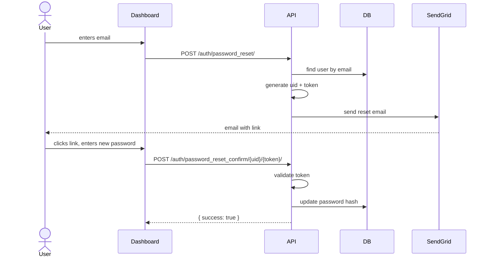

# Accounts API

`Base URL: https://salmakhalill.pythonanywhere.com`

---

### `POST /auth/login/`

```json
{ "email": "admin@securereport.com", "password": "..." }
```

Returns JWT tokens and user info. The `role`, `email`, and `status` are included in the response so the frontend can gate UI elements immediately — no separate `/me/` call needed.

**Response `200`:**
```json
{
  "access": "eyJ...",
  "refresh": "eyJ...",
  "role": "Admin",
  "email": "admin@securereport.com",
  "status": "active"
}
```

**Response `401`:**
```json
{
  "detail": "No active account found with the given credentials"
}
```

---

### `POST /auth/refresh/`

```json
{ "refresh": "eyJ..." }
```

Returns a new `access` token. Access tokens expire in 1 hour, refresh tokens in 7 days.

---

### Password reset



Two steps:

**1. Request the email**  
`POST /auth/password_reset/` → `{ "email": "..." }`

Always returns `200` even if the email doesn't exist — prevents user enumeration.`

**Response `200`**
```json
{
  "message": "If email exists, reset link sent"
}
```

**2. Set the new password**  
`POST /auth/password_reset_confirm/<uidb64>/<token>/`

^ Set a new password using the link from the reset email.

**Request:**
```json
{ "new_password": "...", "confirm_password": "..." }
```
The token is single-use and tied to the user's current password hash, so it invalidates automatically after the password changes. Returns `400` if expired or already used.

**Response `200`:**
```json
{
  "success": true,
  "message": "Password updated successfully"
}
```

**Response `400` — passwords don't match:**
```json
{
  "confirm_password": ["Passwords do not match"]
}
```

**Response `400` — invalid or expired link:**
```json
{
  "message": "Invalid or expired token"
}
```

---

### `GET · PATCH /account/`

View or update the currently logged-in user's profile.

**Headers:**
```http
Authorization: Bearer <access_token>
```

**Response `200`:**
```json
{
  "email": "...",
  "full_name": "...",
  "role": "Admin",
  "status": "active"
}
```

**Request (profile update):**
```json
{
  "full_name": "اسم جديد"
}
```
To change password, include both `current_password` and `new_password`. The endpoint verifies the current password before proceeding.

**Request (password change):**
```json
{
  "current_password": "OldPass123!",
  "new_password": "NewStr0ngPass!"
}
```

**Response `400` — wrong current password:**
```json
{
  "detail": "Current password is incorrect"
}
```

---
### User management — Admin only

**`GET /users/`** — list all staff accounts.

**Response `200`:**
```json
[
  {
    "id": 1,
    "email": "...",
    "full_name": "...",
    "role": "Admin",
    "status": "active",
    "date_joined": "2025-08-01T10:00:00Z"
  },
  {
    "id": 2,
    "email": "...",
    "full_name": "...",
    "role": "Employee",
    "status": "active",
    "date_joined": "2025-08-05T09:00:00Z"
  }
]
```

---

**`POST /users/`** — create a new user.  

**Request:**
```json
{
  "email": "...",
  "full_name": "...",
  "role": "Employee"
}
```
No password needed in the request.

A welcome email is sent with a password setup link.


**Response `201`:** New user object (same shape as GET).

---

**`PATCH /users/<id>/`** — update role or status. Setting `status: Inactive` blocks access without deleting the account.

**Example:**
```json
{
  "status": "Inactive"
}
```

**Response `200`:** Updated user object.

---

**`DELETE /users/<id>/`** — Delete a user.

**Response `204`:** No content.