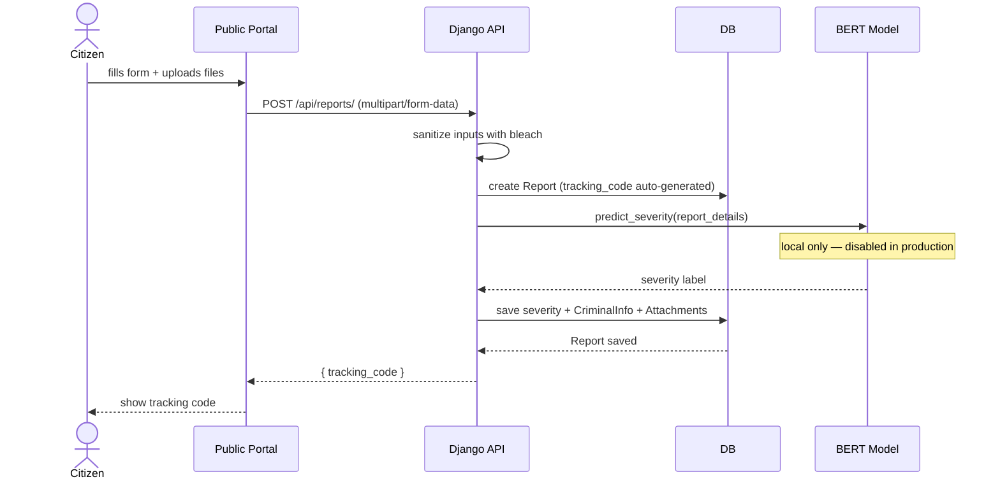
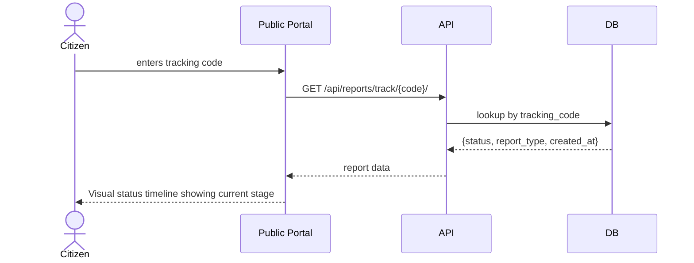

# Reports API

`Base URL: https://salmakhalill.pythonanywhere.com/api`

---

### `POST /reports/` — submit a report



Public. No authentication required. Accepts `multipart/form-data` because the request carries file uploads.

**Fields:**

| Field | Required | Notes |
|---|---|---|
| `location` | yes | Human-readable location name |
| `incident_date` | yes | `YYYY-MM-DD` |
| `report_details` | yes | Sanitized with bleach before saving |
| `report_type` | yes | `اعتداء` · `ابتزاز` · `تحرش` · `سرقة` · `مشادة` |
| `location_link` | no | Any map URL |
| `latitude` / `longitude` | no | GPS coordinates |
| `contact_info` | no | Optional — reporter's choice |
| `criminal_infos` | no | JSON string (see below) |
| `attachments` | no | Audio: `.mp3 .wav .webm .ogg` — everything else → files |

`criminal_infos` is sent as a JSON string inside the form field:
```json
[{ "name": "...", "description": "...", "other_info": "..." }]
```

**Response `201`:**
```json
{
  "id": 42,
  "tracking_code": "A1B2C3D4E5F6",
  "status": "تم استلام البلاغ",
  "location": "القاهرة، شارع التحرير",
  "latitude": "30.044420000000000",
  "longitude": "31.235710000000000",
  "location_link": "https://maps.google.com/?q=...",
  "report_type": "تحرش",
  "incident_date": "2025-08-10",
  "report_details": "...",
  "contact_info": null,
  "severity": null,
  "criminal_infos": [{ "name": "...", "description": "...", "other_info": null }],
  "attachments": [{ "type": "audio", "url": "https://.../media/attachments/audio/rec.webm" }],
  "created_at": "2025-08-10T14:32:00Z"
}
```

`severity` is null on creation. It can later be set manually by staff or populated by the local AI classifier.

---

### `GET /reports/` — list active reports

Requires authentication. Excludes `تم الحل` and `تم الإغلاق` — those are in the archive.

Admins and Employees receive full detail. Viewers receive limited fields only.

**Headers:**
```http
Authorization: Bearer <access_token>
```

**Response `200`:**
```json
[
  {
    "id": 42,
    "tracking_code": "A1B2C3D4E5F6",
    "status": "قيد المراجعة",
    "location": "القاهرة، شارع التحرير",
    "report_type": "تحرش",
    "incident_date": "2025-08-10",
    "report_details": "...",
    "severity": "عالية",
    "criminal_infos": [...],
    "attachments": [...],
    "created_at": "2025-08-10T14:32:00Z"
  }
]
```

Viewer response:
```json
[
  {
    "id": 42,
    "tracking_code": "A1B2C3D4E5F6",
    "status": "قيد المراجعة",
    "report_type": "تحرش",
    "created_at": "2025-08-10T14:32:00Z"
  }
]
```

---

### `GET /reports/track/<tracking_code>/` — track a report



Public. Returns minimal fields — enough to drive the status timeline on the public portal.

**Response `200`:**
```json
{
  "id": 42,
  "tracking_code": "A1B2C3D4E5F6",
  "status": "قيد المعالجة",
  "report_type": "تحرش",
  "created_at": "2025-08-10T14:32:00Z"
}
```

Returns `404` if the code doesn't exist.

---

### `GET /reports/archive/`

Requires authentication.

Returns only reports with status `تم الحل` or `تم الإغلاق`.

Same role-based field restrictions as the list endpoint.

---

### `PATCH /reports/<id>/` — update a report

Admin and Employee only. Partial update — send any subset of fields.

**Headers:**
```http
Authorization: Bearer <access_token>
```

**Example request body:**
```json
{
  "status": "قيد المراجعة",
  "severity": "حرج"
}
```

**Response `200`:** Updated report object.

**Response `403`:**
```json
{
  "detail": "Permission denied."
}
```

---

### `DELETE /reports/<id>/`

Admin and Employee only.

**Headers:**
```http
Authorization: Bearer <access_token>
```

**Response `204`:** No content.

**Response `403`:**
```json
{
  "detail": "Permission denied."
}
```