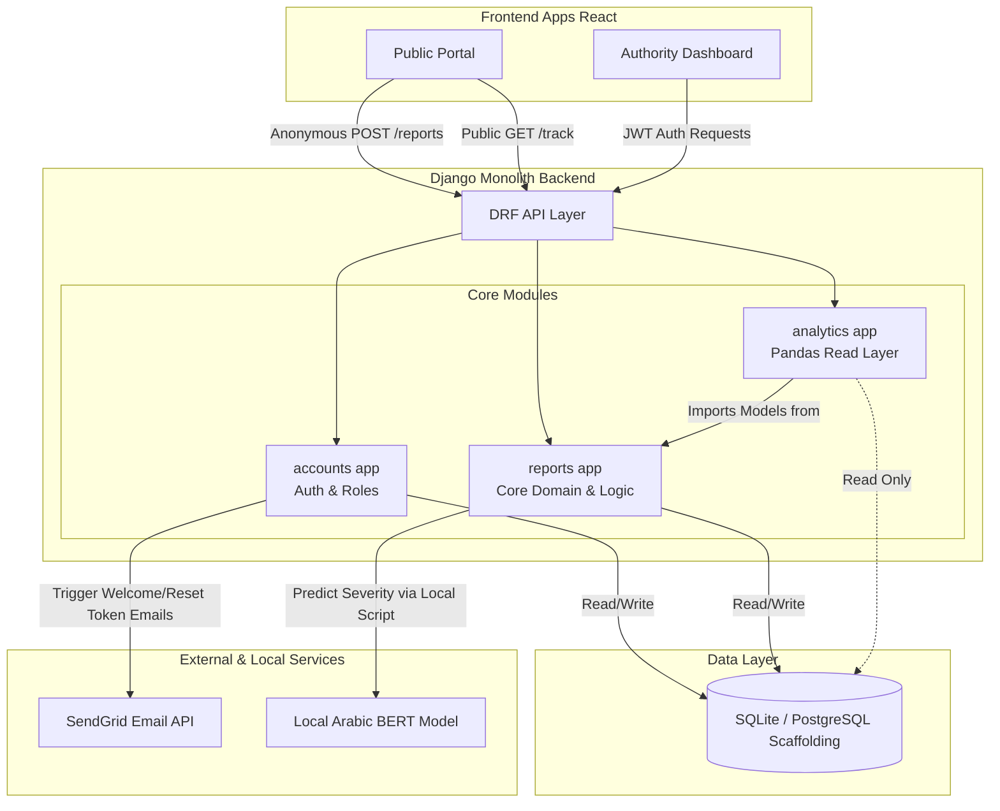
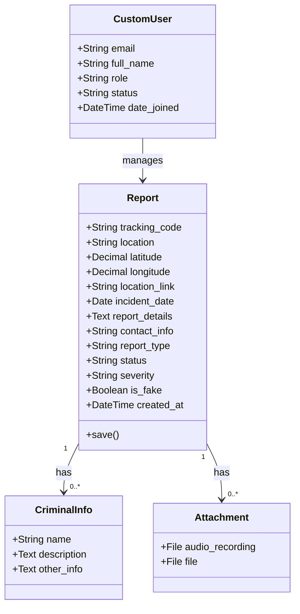

# Architecture & Technical Decisions

---

## App structure

Three apps, each with one job:

```
accounts/   who you are — auth, roles, user management
reports/    what gets reported — the core domain
analytics/  how it's aggregated — reads only, never writes
```

`analytics` imports from `reports`, never the other way around. No circular dependencies. The separation also means if the analytics module breaks, the core reporting flow is unaffected.

---

### System Component Architecture
The following diagram showcases how the frontends, the Django core apps, the database, and the external services interact structurally as isolated components:


---
## Core Domain Models
The following class diagram illustrates the primary entities and their relationships across the apps:


---

## DRF over FastAPI

The project already uses Django's ORM, admin panel, and `AbstractBaseUser`. DRF sits on top of that with near-zero overhead. FastAPI would've meant rebuilding things that come for free.

The nested serializer pattern also fits naturally here — a `Report` submission creates `CriminalInfo` and `Attachment` records in the same request, and DRF handles that cleanly.

---

## JWT + custom login response

Dashboard users need persistent sessions without server-stored state. SimpleJWT handles that with a 1-hour access token and a 7-day refresh token.

The login serializer (`MyTokenObtainPairSerializer`) adds `role`, `email`, and `status` to the response. The frontend gates UI elements immediately without making a separate `/me/` call.

---

## No auth on the public portal

Requiring registration would defeat the entire point. The trade-off is open submission — anyone can file a report, including fake ones. The `is_fake` flag on `Report` lets staff mark them manually.

---

## Role system

Three roles that map directly to real-world access patterns in a government system:

- **Admin** — system owner, manages user accounts, full access, can delete
- **Employee** — case worker, handles reports, can't touch user accounts  
- **Viewer** — observer (e.g. partner organization), read-only, limited fields only

`CustomUser` has both `is_active` (Django built-in) and `status` (our field). `is_active=False` blocks at the auth layer. `status='inactive'` is the application-level check all views enforce — used when someone leaves the organization without deleting their account.

---

## Archive as a separate endpoint

`/api/reports/` and `/api/reports/archive/` are two separate endpoints, not one with a filter param. The active-cases view should never accidentally show closed cases — that's a product requirement enforced in `get_queryset()`, not left to the frontend.

---

## Pandas for analytics

The KPI formulas came from Power BI specs provided by the data analyst on the team — time-bucketing, rolling period comparisons, Arabic label mapping. Translating that into ORM annotations would've been verbose and hard to maintain. Pandas was the cleaner fit.

Known trade-off: loading all reports into a DataFrame per request won't scale past tens of thousands of rows. For the current dataset it's fine. The fix — database-level aggregation or a caching layer — can be dropped in without changing the API shape.

---

## SQLite in production

PythonAnywhere's free tier doesn't support external DB connections. SQLite covers the current load — mostly reads, infrequent writes. The settings file has PostgreSQL config commented out for when the project moves to a paid tier.

---

## Security hardening

Enabled in production (`DEBUG=False`):

| Setting | Purpose |
|---|---|
| `SECURE_SSL_REDIRECT` | Force HTTPS |
| `SESSION_COOKIE_SECURE` | Session cookie over HTTPS only |
| `CSRF_COOKIE_SECURE` | CSRF cookie over HTTPS only |
| `SESSION_COOKIE_HTTPONLY` | No JS access to session cookie |
| `X_FRAME_OPTIONS = DENY` | Prevent clickjacking |
| `SECURE_CONTENT_TYPE_NOSNIFF` | Prevent MIME sniffing |
| `SECURE_BROWSER_XSS_FILTER` | Browser XSS protection header |

Public portal input (`location`, `report_details`, `contact_info`) is sanitized with `bleach` — HTML stripped before touching the database.

---

## SendGrid over SMTP

Gmail SMTP needs app passwords and has tighter rate limits. SendGrid's free tier is simpler and HTML templates render more reliably. Both transactional emails (welcome and password reset) use Django's `default_token_generator` — single-use tokens tied to the user's current password hash.

---

## AI classifier

Fine-tuned Arabic BERT model (~400MB) — predicts severity at submission time. Excluded from the deployed version because the weights exceed PythonAnywhere's memory limit for web workers.

The call in `views.py` is commented out, not deleted. The `severity` field stays on the model, staff can set it manually, and the backfill script in `ml_model.py` can populate it locally when needed.