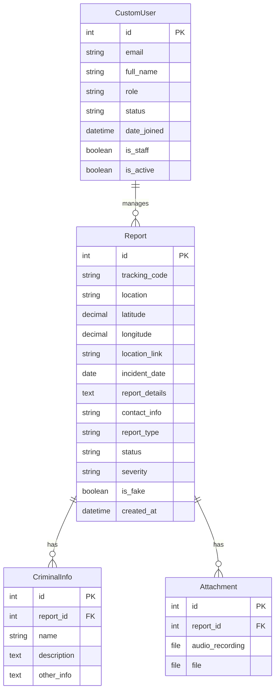

# Entity Relationship Diagram

```mermaid
erDiagram
    Report {
        int id PK
        string tracking_code
        string location
        decimal latitude
        decimal longitude
        string location_link
        date incident_date
        text report_details
        string contact_info
        string report_type
        string status
        string severity
        boolean is_fake
        datetime created_at
    }
    CriminalInfo {
        int id PK
        int report_id FK
        string name
        text description
        text other_info
    }
    Attachment {
        int id PK
        int report_id FK
        file audio_recording
        file file
    }
    CustomUser {
        int id PK
        string email
        string full_name
        string role
        string status
        datetime date_joined
        boolean is_staff
        boolean is_active
    }
    Report ||--o{ CriminalInfo : "has"
    Report ||--o{ Attachment : "has"
    CustomUser ||--o{ Report : "manages"
```