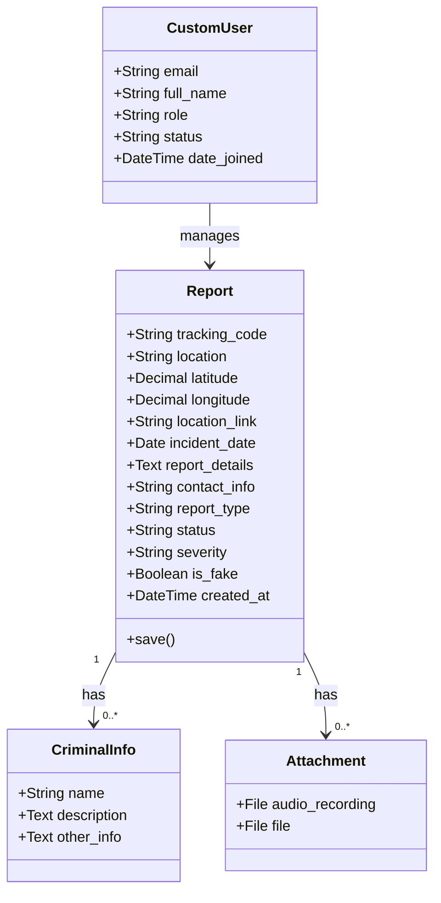
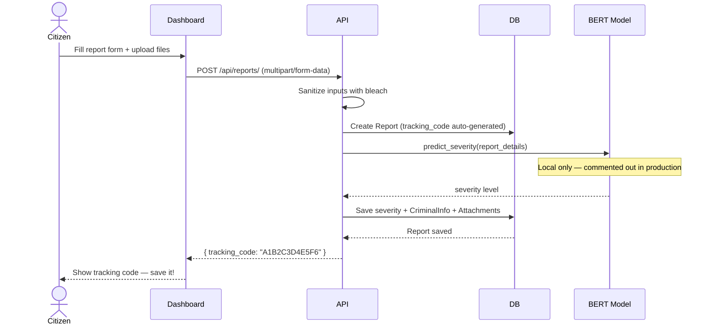
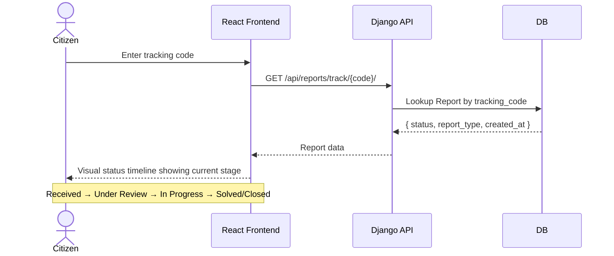
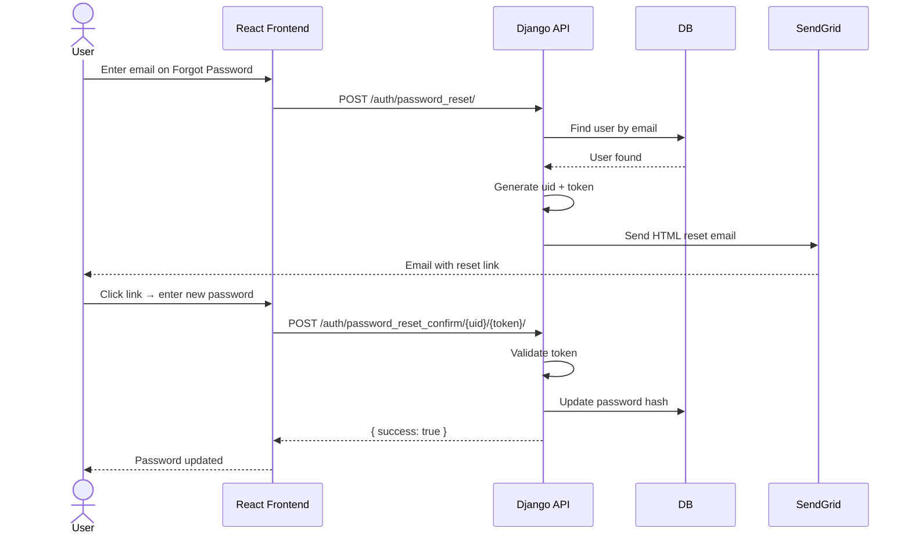
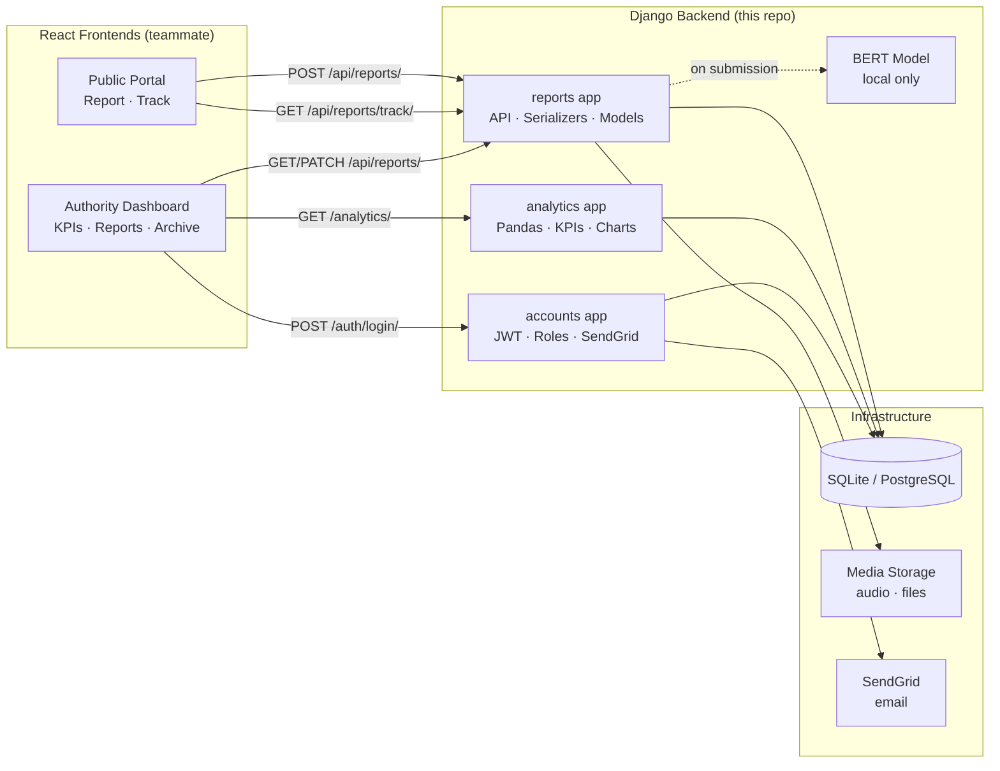

<div align="center">

# 🛡️ SecureReport

**منصة بلاغات آمنة ومجهولة الهوية — من Digitopia 2025**


<br/>

> Built for **[Digitopia 2025](https://digitopia.gov.eg)** — Egypt's national ICT competition under the Ministry of Communications.
> We reached **Phase 3** out of 4. 🏆

**This repository contains the backend only.**
The frontend (React) was built by a teammate — my role was backend development and API integration with the React client.

</div>

---

## The Problem

A lot of people witness crimes or get harassed but never report them — not because they don't want to, but because they're afraid. Afraid of being identified. Afraid of retaliation. Afraid that no one will take it seriously.

SecureReport was built to remove that fear. Anyone can submit a report completely anonymously, attach evidence, and get a tracking code to follow up on their case.

---

## What Is SecureReport?

SecureReport is two web apps (two React frontends, one Django backend):

**1. Public Reporting Portal** — anyone can file a report with no registration, upload evidence, and receive a tracking code to follow their case through a visual status timeline.

**2. Authority Dashboard** — a protected interface for the relevant organization to receive, review, manage, and archive reports, with full analytics.

---

## Features

### Public Portal
- Anonymous reporting — no account, no identity required
- 5 report types: Assault, Blackmail, Harassment, Theft, Altercation
- Rich report details: location with map link and coordinates, incident date, description
- Criminal info: name, description, additional notes
- File attachments: audio recordings, images, documents
- Auto-generated 12-character tracking code per report
- Report tracking with a status timeline — the frontend renders each status stage visually so the reporter knows exactly where their case stands

### Authority Dashboard
- JWT-secured login with role-based access (Admin / Employee / Viewer)
- Password reset by email via SendGrid
- KPI cards with trend indicators: Total Reports, New Reports, Under Review, Critical Reports
- Statistics page filterable by year
- Reports table — update status, manage active cases
- Archive — reports move here automatically when status is Solved or Closed
- Account settings — update profile and change password
- Heatmap — geographic distribution of incidents

### AI Severity Classifier *(local only — not deployed)*
- Fine-tuned BERT model to auto-classify report severity: Critical / High / Medium / Low
- Runs inference on `report_details` text at submission time
- Excluded from deployment due to model size constraints — runs locally only

---

## Tech Stack

| Layer | Technology |
|---|---|
| Framework | Django 5.2 + Django REST Framework |
| Auth | SimpleJWT (access: 1h, refresh: 7d) |
| Database | SQLite (dev) / SQLite on PythonAnywhere (prod) |
| Analytics | Pandas · NumPy (translated from Power BI specs) |
| AI Model | HuggingFace Transformers — BERT (local) |
| Email | SendGrid |
| Input Sanitization | bleach |
| Frontend | React — built by teammate, integrated via REST API + CORS |
| Deployment | PythonAnywhere (`salmakhalill.pythonanywhere.com`) |
| CORS | django-cors-headers |

---

## My Role

This was a 5-person team project:

| Role | Responsibilities |
|---|---|
| **Backend (me)** | Django REST API, database models, analytics with Pandas + NumPy, JWT auth, role system, password reset, SendGrid integration, CORS config, production deployment on PythonAnywhere, security hardening |
| Frontend | React — public reporting portal + authority dashboard (two separate domains) |
| AI / Data Analyst | BERT severity classification model + Power BI analytics specs and KPI definitions |
| Security | Penetration testing |

The React frontend consumes this API. I handled all integration points: CORS setup, multipart form handling for file uploads, JWT token flow, and making sure the API responses matched what the frontend needed.

The analytics module was built by translating Power BI specs and KPI definitions (provided by the data analyst teammate) into server-side Python using Pandas and NumPy — serving the results as a REST API consumed by the React dashboard.

---

## Project Structure

```
backend/
├── config/              # Django settings & root URLs
├── accounts/            # Custom user model, JWT auth, roles, password reset
│   ├── services/
│   │   ├── auth_service.py      # UID/token helpers
│   │   └── email_service.py     # SendGrid integration
│   └── templates/accounts/emails/
│       ├── welcome_user.html
│       └── reset_password.html
├── reports/             # Core report logic
│   ├── models.py        # Report, CriminalInfo, Attachment
│   ├── serializers.py   # Nested serializers + input sanitization
│   ├── views.py         # List/Create/Update/Delete/Track/Archive
│   └── ml_model.py      # BERT severity classifier (local only)
└── analytics/           # Dashboard data
    ├── utils.py         # Pandas processing, KPI & chart helpers
    └── views.py         # REST endpoints for dashboard
```

---

## API Endpoints

### Reports
| Method | Endpoint | Auth | Description |
|---|---|---|---|
| `POST` | `/api/reports/` | None | Submit anonymous report |
| `GET` | `/api/reports/` | Required | List active reports |
| `GET` | `/api/reports/track/<code>/` | None | Track report by code |
| `GET` | `/api/reports/archive/` | Required | List archived reports |
| `PATCH` | `/api/reports/<id>/` | Admin / Employee | Update report |
| `DELETE` | `/api/reports/<id>/` | Admin / Employee | Delete report |

### Analytics
| Method | Endpoint | Auth | Description |
|---|---|---|---|
| `GET` | `/analytics/stats/` | Required | Classic dashboard — filterable by year |
| `GET` | `/analytics/recent/` | Required | Recent KPIs — daily / weekly / monthly |
| `GET` | `/analytics/site_stats/` | None | Public stats for landing page |

### Accounts
| Method | Endpoint | Auth | Description |
|---|---|---|---|
| `POST` | `/auth/login/` | None | Login — returns JWT + role |
| `POST` | `/auth/refresh/` | None | Refresh access token |
| `POST` | `/auth/password_reset/` | None | Request reset email |
| `POST` | `/auth/password_reset_confirm/<uid>/<token>/` | None | Set new password |
| `GET / PATCH` | `/account/` | Active user | View or update own account |
| `GET / POST / PATCH / DELETE` | `/users/` | Admin only | Manage all users |

---

## User Roles

| Role | View Reports | Update Status | Delete | Manage Users |
|---|---|---|---|---|
| Admin | Full detail | Yes | Yes | Yes |
| Employee | Full detail | Yes | Yes | No |
| Viewer | Limited fields | No | No | No |

Inactive users of any role get empty responses, even with a valid token.

---

## Report Lifecycle

```
Submit Report
     │
     ▼
تم استلام البلاغ  (Received)
     │
     ▼
قيد المراجعة  (Under Review)
     │
     ▼
قيد المعالجة  (In Progress)
     │
     ├──▶  تم الحل  (Solved)  ──▶  Archive
     │
     └──▶  تم الإغلاق  (Closed)  ──▶  Archive
```

The React frontend renders this as a visual timeline when the reporter enters their tracking code.

---

## Production Config Highlights

The production settings include Django security hardening that's off in dev:

```python
SESSION_COOKIE_SECURE = True
CSRF_COOKIE_SECURE = True
SESSION_COOKIE_HTTPONLY = True
CSRF_COOKIE_HTTPONLY = True
SECURE_SSL_REDIRECT = True
X_FRAME_OPTIONS = "DENY"
SECURE_BROWSER_XSS_FILTER = True
SECURE_CONTENT_TYPE_NOSNIFF = True
```

`DEBUG` is driven by an environment variable so dev and prod never share the same config. All secrets (secret key, SendGrid API key, sender email) are loaded from `.env` via `python-dotenv`.

---

## Mermaid Diagrams

### Class Diagram



---

### Sequence Diagram — Anonymous Report Submission



---

### Sequence Diagram — Report Tracking with Timeline



---

### Sequence Diagram — Password Reset Flow



---

### Component Diagram



---

## Local Setup

```bash
# 1. Clone and create virtual environment
git clone https://github.com/salmakhalill/SecureReport_django.git
cd SecureReport_django
python -m venv venv
source venv/bin/activate  # Windows: venv\Scripts\activate

# 2. Install dependencies
pip install -r requirements.txt

# 3. Set environment variables
cp .env.example .env
# Fill in: SECRET_KEY, SENDGRID_API_KEY, DEFAULT_FROM_EMAIL

# 4. Run migrations and create admin
python manage.py migrate
python manage.py createsuperuser

# 5. Start server
python manage.py runserver
```

### Environment Variables

```env
SECRET_KEY=your-django-secret-key
DEBUG=True
SENDGRID_API_KEY=your-sendgrid-key
DEFAULT_FROM_EMAIL=noreply@yourdomain.com
```

---

## AI Model (Local Only)

The severity classifier is a fine-tuned BERT model trained on Arabic crime report text. It predicts one of four levels: حرج / عالية / متوسطة / منخفضة (Critical / High / Medium / Low).

To run it locally, place the model in the path set by `MODEL_DIR` in `reports/ml_model.py`, then uncomment the inference call in `views.py`.

To backfill severity on existing reports:
```python
# python manage.py shell
from reports.models import Report
from reports.ml_model import predict_severity

for report in Report.objects.filter(severity__isnull=True):
    report.severity = predict_severity(report.report_details)
    report.save(update_fields=["severity"])
```

---

## Live Demo

Backend deployed at: `https://salmakhalill.pythonanywhere.com`

---

<div align="center">
  <sub>Built with care for a safer Egypt 🇪🇬 — Digitopia 2025, Phase 3</sub>
</div>